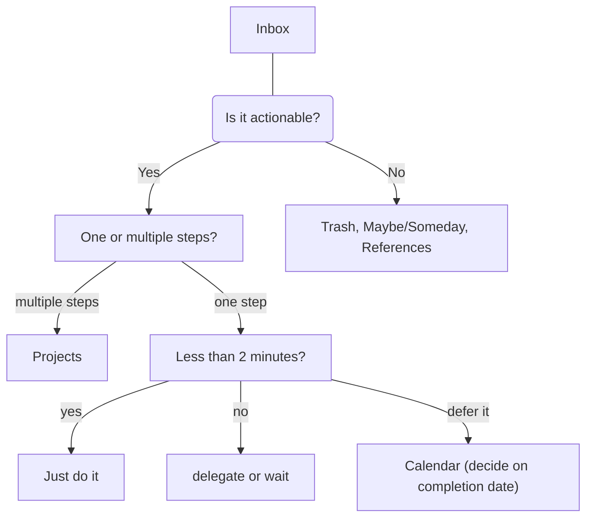

# notes

a simple note app
built with

- SvelteKit
- Lucia
- Mongoose

## using GTD for workflow w notes

The basic idea is to help your mind organizing itself in 5 steps.

1. Capture
2. Clarify
3. Organize
4. Reflect
5. Engange

