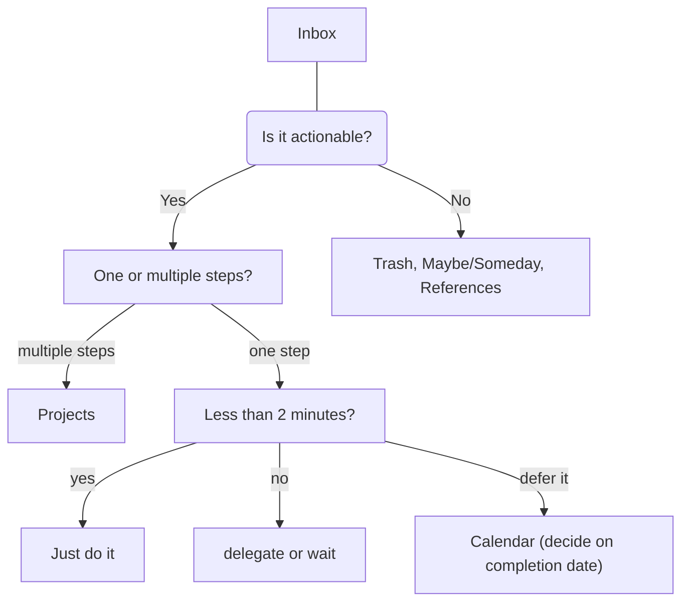

# AUGMENTS

a note app
built with

- SvelteKit
- Lucia
- Mongoose

following the GTD
system by David Allen.

## GTD & AUGMENTS

The basic idea is to help your mind organizing itself with a few guidelines, a workspace and a 5 step workflow to follow up on your augments.

### WORKSPACE & TOOLS

The basic setup for the workspace is the inbox/your notes section, a trash can, a reference section, lists, a calendar.

These tools dont necessarily need to be digital, but while be provided here and added to the workflow.

### WRITING AUGMENTS

In your inbox create a note/augment that is something thats causing you stress or that you are just thinking about. Allen calls these "open loops", "incompletes", "stuff", I refer to them as notes/augments to broaden the term a little.

#### GUIDELINES

Allen offers a few guidelines to help create more actionable steps out your augments.

1. Define the augment/note, just write it down.
2. Add a description when the succesfull outcome is achieved and you can consider it done.
3. If necessary add steps to approach the completion.
4. After completion reflect on process/emotions.

### WORKFLOWS

These are also embedded to the workflow that helps one to clear your head, but still have an organized system that offers you a backbone for your daily life.

1. Capture
2. Clarify
3. Organize
4. Reflect
5. Engange

After creating an augment use this flow to assign to the right spot in your workflow/workspace.

